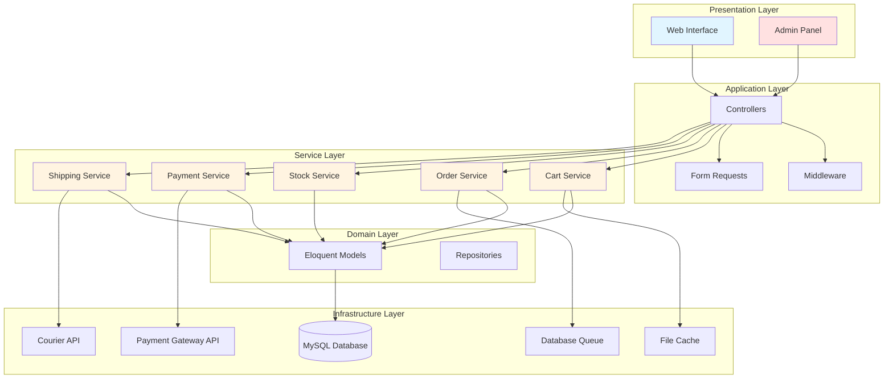
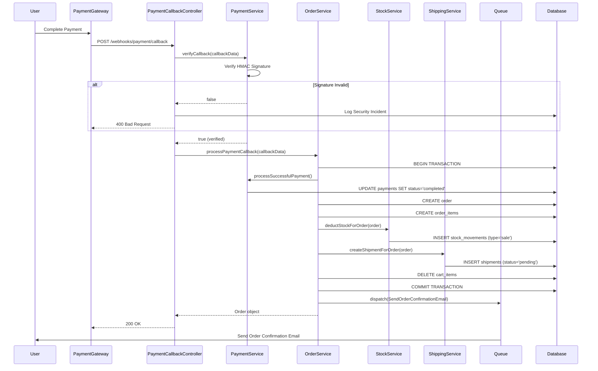

# Technical Design Document

## Overview

This document specifies the technical design for a production-ready Laravel e-commerce platform targeting shared hosting environments. The system implements a monolithic architecture with service layer pattern, handling the complete order lifecycle from product browsing through payment processing to shipment tracking.

### System Characteristics

- **Architecture Pattern**: Laravel monolith with service layer
- **Deployment Target**: Shared hosting (Hostinger Business Plan)
- **Scale**: 0-1000 products, small to medium traffic
- **Infrastructure Constraints**: No Docker, Redis, or long-running Node services
- **Cache Strategy**: File-based cache driver
- **Queue Strategy**: Database queue driver with cron-based processing
- **Payment Integration**: Abstracted gateway (iyzico OR Stripe)
- **Shipping Integration**: Abstracted courier service layer

### Key Design Principles

1. **Shared Hosting First**: All architectural decisions prioritize compatibility with standard PHP + MySQL hosting
2. **Service Layer Pattern**: Business logic isolated in service classes, controllers remain thin
3. **Transaction Safety**: Critical flows (order creation, stock deduction) wrapped in database transactions
4. **Event-Driven Stock**: Stock calculated from movements table, never stored as single column
5. **Payment Callback Security**: Signature verification mandatory before processing callbacks
6. **Performance Optimization**: Eager loading, pagination, and strategic indexing throughout
7. **SEO Optimization**: Slugs, meta tags, structured data, and sitemap generation

## Architecture

### High-Level Architecture



### Request Flow Patterns

**Public Product Browsing Flow:**
```
User Request → Route → Controller → Catalog Service → Product Model → Database → View
```

**Cart Management Flow:**
```
User Request → Route → Middleware (Auth/Guest) → Controller → Cart Service → Cart Model → Database → JSON Response
```

**Critical Order Flow:**
```
Payment Callback → Signature Verification → Payment Service → Order Service → 
[Transaction Start] → Create Order → Stock Service (Deduct) → Shipping Service (Create Shipment) → 
[Transaction Commit] → Queue Email → Response
```

### Directory Structure

```
app/
├── Http/
│   ├── Controllers/
│   │   ├── Web/
│   │   │   ├── HomeController.php
│   │   │   ├── ProductController.php
│   │   │   ├── CartController.php
│   │   │   ├── CheckoutController.php
│   │   │   └── OrderController.php
│   │   ├── Admin/
│   │   │   ├── DashboardController.php
│   │   │   ├── ProductController.php
│   │   │   ├── OrderController.php
│   │   │   ├── CategoryController.php
│   │   │   └── StockController.php
│   │   └── Webhooks/
│   │       └── PaymentCallbackController.php
│   ├── Middleware/
│   │   ├── AdminMiddleware.php
│   │   └── ThrottleCheckout.php
│   └── Requests/
│       ├── StoreProductRequest.php
│       ├── UpdateCartRequest.php
│       ├── CheckoutRequest.php
│       └── StockAdjustmentRequest.php
├── Services/
│   ├── CartService.php
│   ├── OrderService.php
│   ├── StockService.php
│   ├── PaymentService.php
│   ├── ShippingService.php
│   ├── SeoService.php
│   └── ImageService.php
├── Models/
│   ├── User.php
│   ├── Category.php
│   ├── Product.php
│   ├── ProductVariant.php
│   ├── ProductImage.php
│   ├── Cart.php
│   ├── CartItem.php
│   ├── Address.php
│   ├── Order.php
│   ├── OrderItem.php
│   ├── Payment.php
│   ├── Shipment.php
│   └── StockMovement.php
├── Contracts/
│   ├── PaymentGatewayInterface.php
│   └── CourierServiceInterface.php
├── Integrations/
│   ├── Payment/
│   │   ├── IyzicoGateway.php
│   │   └── StripeGateway.php
│   └── Shipping/
│       ├── ManualCourier.php
│       └── ApiCourier.php (future)
└── Jobs/
    ├── SendOrderConfirmationEmail.php
    ├── SendShipmentNotificationEmail.php
    └── ProcessQueuedJobs.php

database/
├── migrations/
│   ├── 2024_01_01_000001_create_users_table.php
│   ├── 2024_01_01_000002_create_categories_table.php
│   ├── 2024_01_01_000003_create_products_table.php
│   ├── 2024_01_01_000004_create_product_variants_table.php
│   ├── 2024_01_01_000005_create_product_images_table.php
│   ├── 2024_01_01_000006_create_carts_table.php
│   ├── 2024_01_01_000007_create_cart_items_table.php
│   ├── 2024_01_01_000008_create_addresses_table.php
│   ├── 2024_01_01_000009_create_orders_table.php
│   ├── 2024_01_01_000010_create_order_items_table.php
│   ├── 2024_01_01_000011_create_payments_table.php
│   ├── 2024_01_01_000012_create_shipments_table.php
│   └── 2024_01_01_000013_create_stock_movements_table.php
└── seeders/
    ├── DatabaseSeeder.php
    ├── AdminUserSeeder.php
    └── CategorySeeder.php

resources/
├── views/
│   ├── layouts/
│   │   ├── app.blade.php
│   │   └── admin.blade.php
│   ├── web/
│   │   ├── home.blade.php
│   │   ├── category.blade.php
│   │   ├── product.blade.php
│   │   ├── cart.blade.php
│   │   └── checkout.blade.php
│   └── admin/
│       ├── dashboard.blade.php
│       ├── products/
│       ├── orders/
│       └── categories/
└── js/
    ├── app.js
    └── admin.js

public/
├── index.php
├── css/
├── js/
└── storage/ (symlink)

routes/
├── web.php
├── admin.php
└── webhooks.php
```


## Components and Interfaces

### Service Layer Components

#### CartService

**Responsibility:** Manages shopping cart operations including add, update, remove, and cart merging.

**Public Methods:**
```php
class CartService
{
    public function getOrCreateCart(User|string $userOrSession): Cart;
    public function addItem(Cart $cart, ProductVariant $variant, int $quantity): CartItem;
    public function updateItemQuantity(CartItem $item, int $quantity): CartItem;
    public function removeItem(CartItem $item): void;
    public function mergeCarts(Cart $sessionCart, Cart $userCart): Cart;
    public function clearCart(Cart $cart): void;
    public function calculateTotal(Cart $cart): array; // ['subtotal', 'items_count']
    public function validateStock(Cart $cart): array; // ['valid' => bool, 'errors' => []]
}
```

**Dependencies:**
- Cart Model
- CartItem Model
- ProductVariant Model
- Cache (for cart totals)

**Key Behaviors:**
- Associates carts with user_id for authenticated users, session_id for guests
- Stores price at time of addition for price change detection
- Validates stock availability before adding items
- Merges session cart into user cart on login

#### OrderService

**Responsibility:** Orchestrates order creation, payment processing, and order lifecycle management.

**Public Methods:**
```php
class OrderService
{
    public function __construct(
        private StockService $stockService,
        private ShippingService $shippingService,
        private PaymentService $paymentService
    ) {}
    
    public function createOrderFromCart(Cart $cart, Address $address, string $paymentMethod): Order;
    public function processPaymentCallback(array $callbackData): Order;
    public function cancelOrder(Order $order, string $reason): void;
    public function generateOrderNumber(): string;
    public function calculateOrderTotals(Cart $cart, Address $address): array;
}
```

**Dependencies:**
- Order Model
- OrderItem Model
- Cart Model
- StockService
- ShippingService
- PaymentService
- Database Transactions

**Key Behaviors:**
- Wraps order creation in database transaction
- Generates unique order numbers (format: ORD-YYYYMMDD-XXXXX)
- Locks prices and variant details at order creation time
- Triggers stock deduction via StockService
- Creates shipment via ShippingService
- Queues order confirmation email
- Clears cart after successful order creation

**Transaction Flow:**
```php
DB::transaction(function () use ($cart, $address) {
    // 1. Create order record
    $order = Order::create([...]);
    
    // 2. Create order items
    foreach ($cart->items as $item) {
        OrderItem::create([...]);
    }
    
    // 3. Deduct stock
    $this->stockService->deductStockForOrder($order);
    
    // 4. Create shipment
    $this->shippingService->createShipmentForOrder($order);
    
    // 5. Clear cart
    $cart->items()->delete();
    
    return $order;
});
```

#### StockService

**Responsibility:** Manages inventory through stock movements, ensuring accurate stock tracking.

**Public Methods:**
```php
class StockService
{
    public function getCurrentStock(ProductVariant $variant): int;
    public function deductStockForOrder(Order $order): void;
    public function restoreStockForCancellation(Order $order): void;
    public function adjustStock(ProductVariant $variant, int $quantity, string $reason): StockMovement;
    public function getStockHistory(ProductVariant $variant): Collection;
    public function validateStockAvailability(ProductVariant $variant, int $quantity): bool;
}
```

**Dependencies:**
- StockMovement Model
- ProductVariant Model

**Key Behaviors:**
- Never stores stock as single column on product_variants
- Calculates current stock by summing all stock_movements for variant
- Creates movement records for: purchase, sale, cancellation, refund, manual_adjustment
- Prevents negative stock through validation
- Logs all stock changes with reference_id (order_id, etc.)

**Stock Calculation:**
```php
public function getCurrentStock(ProductVariant $variant): int
{
    return StockMovement::where('product_variant_id', $variant->id)
        ->sum('quantity_change');
}
```

**Movement Types:**
- `purchase`: Stock added (positive quantity)
- `sale`: Stock sold (negative quantity)
- `cancellation`: Stock restored from cancelled order (positive quantity)
- `refund`: Stock restored from refund (positive quantity)
- `manual_adjustment`: Admin adjustment (positive or negative)

#### PaymentService

**Responsibility:** Abstracts payment gateway integration and handles payment lifecycle.

**Public Methods:**
```php
class PaymentService
{
    public function __construct(private PaymentGatewayInterface $gateway) {}
    
    public function initiatePayment(Order $order): array; // ['payment_url', 'payment_id']
    public function verifyCallback(array $callbackData): bool;
    public function processSuccessfulPayment(string $transactionId, Order $order): Payment;
    public function processFailedPayment(string $transactionId, Order $order, string $reason): Payment;
    public function getPaymentStatus(Payment $payment): string;
}
```

**Dependencies:**
- Payment Model
- PaymentGatewayInterface
- Order Model

**Key Behaviors:**
- Uses dependency injection for gateway implementation
- Verifies callback signatures before processing
- Creates payment records with status: pending, completed, failed
- Stores transaction IDs from gateway
- Logs all signature verification failures

#### ShippingService

**Responsibility:** Manages shipment creation, tracking, and courier integration.

**Public Methods:**
```php
class ShippingService
{
    public function __construct(private CourierServiceInterface $courier) {}
    
    public function createShipmentForOrder(Order $order): Shipment;
    public function updateShipmentStatus(Shipment $shipment, string $status): void;
    public function addTrackingNumber(Shipment $shipment, string $trackingNumber, string $courierName): void;
    public function getTrackingInfo(Shipment $shipment): ?array;
    public function calculateShippingCost(Address $address, Cart $cart): float;
}
```

**Dependencies:**
- Shipment Model
- CourierServiceInterface
- Order Model

**Key Behaviors:**
- Creates shipment with status "pending" when order is created
- Supports statuses: pending, preparing, shipped, in_transit, delivered, returned
- Records shipped_at timestamp when status changes to "shipped"
- Queues shipment notification email when tracking number added
- Provides abstraction for future courier API integration

#### SeoService

**Responsibility:** Handles SEO-related functionality including slugs, meta tags, and sitemap generation.

**Public Methods:**
```php
class SeoService
{
    public function generateSlug(string $title, string $modelClass): string;
    public function generateSitemap(): string;
    public function generateProductSchema(Product $product): array;
    public function createRedirect(string $oldSlug, string $newSlug): void;
}
```

**Dependencies:**
- Product Model
- Category Model
- Cache

**Key Behaviors:**
- Generates unique SEO-friendly slugs
- Creates 301 redirects when slugs change
- Generates sitemap.xml with lastmod, changefreq, priority
- Generates Schema.org Product structured data
- Caches sitemap for performance

#### ImageService

**Responsibility:** Handles image upload, optimization, and serving.

**Public Methods:**
```php
class ImageService
{
    public function uploadProductImage(UploadedFile $file, Product $product): ProductImage;
    public function generateThumbnails(ProductImage $image): void;
    public function deleteImage(ProductImage $image): void;
    public function optimizeImage(string $path): void;
}
```

**Dependencies:**
- ProductImage Model
- Storage Facade
- Image Intervention (or similar)

**Key Behaviors:**
- Validates file type (JPEG, PNG, WebP) and size (max 5MB)
- Generates multiple sizes: thumbnail (150x150), medium (500x500), large (1200x1200)
- Converts to WebP with JPEG/PNG fallback
- Stores images in public/storage/products/{product_id}/
- Sets appropriate cache headers (1 year)

### Payment Gateway Abstraction

**Interface:**
```php
interface PaymentGatewayInterface
{
    public function initiate(Order $order): array; // ['payment_url', 'payment_id']
    public function verifyCallback(array $callbackData): bool;
    public function getTransactionId(array $callbackData): string;
    public function getPaymentStatus(array $callbackData): string; // 'success', 'failed', 'pending'
    public function getFailureReason(array $callbackData): ?string;
}
```

**Implementations:**

**IyzicoGateway:**
```php
class IyzicoGateway implements PaymentGatewayInterface
{
    private string $apiKey;
    private string $secretKey;
    private string $baseUrl;
    
    public function initiate(Order $order): array
    {
        // Create iyzico payment request
        // Return payment URL and payment ID
    }
    
    public function verifyCallback(array $callbackData): bool
    {
        // Verify iyzico signature using HMAC-SHA256
        // Return true if signature valid
    }
    
    // ... other methods
}
```

**StripeGateway:**
```php
class StripeGateway implements PaymentGatewayInterface
{
    private string $apiKey;
    private string $webhookSecret;
    
    public function initiate(Order $order): array
    {
        // Create Stripe checkout session
        // Return checkout URL and session ID
    }
    
    public function verifyCallback(array $callbackData): bool
    {
        // Verify Stripe webhook signature
        // Return true if signature valid
    }
    
    // ... other methods
}
```

**Configuration:**
```php
// config/payment.php
return [
    'gateway' => env('PAYMENT_GATEWAY', 'iyzico'), // 'iyzico' or 'stripe'
    
    'iyzico' => [
        'api_key' => env('IYZICO_API_KEY'),
        'secret_key' => env('IYZICO_SECRET_KEY'),
        'base_url' => env('IYZICO_BASE_URL', 'https://api.iyzipay.com'),
    ],
    
    'stripe' => [
        'api_key' => env('STRIPE_API_KEY'),
        'webhook_secret' => env('STRIPE_WEBHOOK_SECRET'),
    ],
];

// Service Provider binding
$this->app->bind(PaymentGatewayInterface::class, function ($app) {
    $gateway = config('payment.gateway');
    
    return match($gateway) {
        'iyzico' => new IyzicoGateway(
            config('payment.iyzico.api_key'),
            config('payment.iyzico.secret_key'),
            config('payment.iyzico.base_url')
        ),
        'stripe' => new StripeGateway(
            config('payment.stripe.api_key'),
            config('payment.stripe.webhook_secret')
        ),
        default => throw new \Exception("Unsupported payment gateway: {$gateway}")
    };
});
```

### Courier Service Abstraction

**Interface:**
```php
interface CourierServiceInterface
{
    public function createShipment(Order $order, Address $address): array; // ['tracking_number', 'label_url']
    public function getTrackingInfo(string $trackingNumber): ?array;
    public function cancelShipment(string $trackingNumber): bool;
    public function calculateShippingCost(Address $address, float $weight): float;
}
```

**Implementations:**

**ManualCourier (Phase 1):**
```php
class ManualCourier implements CourierServiceInterface
{
    public function createShipment(Order $order, Address $address): array
    {
        // Manual shipment - admin enters tracking number later
        return [
            'tracking_number' => null,
            'label_url' => null,
        ];
    }
    
    public function getTrackingInfo(string $trackingNumber): ?array
    {
        // Return null - manual tracking
        return null;
    }
    
    public function calculateShippingCost(Address $address, float $weight): float
    {
        // Simple flat rate or zone-based calculation
        return $this->getFlatRate($address);
    }
    
    private function getFlatRate(Address $address): float
    {
        // Example: different rates by city/region
        return match($address->city) {
            'Istanbul', 'Ankara', 'Izmir' => 15.00,
            default => 25.00,
        };
    }
}
```

**ApiCourier (Phase 2 - Future):**
```php
class ApiCourier implements CourierServiceInterface
{
    private string $apiKey;
    private string $baseUrl;
    
    public function createShipment(Order $order, Address $address): array
    {
        // Call courier API to create shipment
        // Return tracking number and label URL
    }
    
    public function getTrackingInfo(string $trackingNumber): ?array
    {
        // Call courier API for tracking info
        // Return status, location, estimated delivery
    }
    
    // ... other methods
}
```

### Middleware Components

**AdminMiddleware:**
```php
class AdminMiddleware
{
    public function handle(Request $request, Closure $next)
    {
        if (!auth()->check()) {
            return redirect()->route('login');
        }
        
        if (!auth()->user()->isAdmin()) {
            abort(403, 'Unauthorized access');
        }
        
        return $next($request);
    }
}
```

**ThrottleCheckout:**
```php
class ThrottleCheckout
{
    public function handle(Request $request, Closure $next)
    {
        // Limit checkout attempts to prevent abuse
        // 5 attempts per minute per IP
        return RateLimiter::attempt(
            'checkout:' . $request->ip(),
            5,
            fn() => $next($request),
            60
        ) ?: response('Too many checkout attempts', 429);
    }
}
```

### Form Request Validation

**CheckoutRequest:**
```php
class CheckoutRequest extends FormRequest
{
    public function rules(): array
    {
        return [
            'address_id' => 'required|exists:addresses,id',
            'payment_method' => 'required|in:iyzico,stripe',
            'terms_accepted' => 'required|accepted',
        ];
    }
    
    public function authorize(): bool
    {
        // Verify address belongs to user
        $address = Address::find($this->address_id);
        return $address && $address->user_id === auth()->id();
    }
}
```

**StoreProductRequest:**
```php
class StoreProductRequest extends FormRequest
{
    public function rules(): array
    {
        return [
            'title' => 'required|string|max:255',
            'slug' => 'required|string|unique:products,slug|regex:/^[a-z0-9-]+$/',
            'description' => 'required|string',
            'category_id' => 'required|exists:categories,id',
            'meta_title' => 'nullable|string|max:60',
            'meta_description' => 'nullable|string|max:160',
            'variants' => 'required|array|min:1',
            'variants.*.sku' => 'required|string|unique:product_variants,sku',
            'variants.*.price' => 'required|numeric|min:0',
            'variants.*.attributes' => 'nullable|array',
            'images' => 'nullable|array',
            'images.*' => 'image|mimes:jpeg,png,webp|max:5120', // 5MB
        ];
    }
}
```

### Critical Order Flow Sequence



### Admin Panel Route Obfuscation

**Route Configuration:**
```php
// routes/admin.php
Route::prefix(config('admin.route_prefix'))
    ->name('admin.')
    ->middleware(['web', 'auth', 'admin'])
    ->group(function () {
        Route::get('/', [DashboardController::class, 'index'])->name('dashboard');
        Route::resource('products', ProductController::class);
        Route::resource('orders', OrderController::class);
        Route::resource('categories', CategoryController::class);
        Route::post('stock/adjust', [StockController::class, 'adjust'])->name('stock.adjust');
    });

// config/admin.php
return [
    'route_prefix' => env('ADMIN_ROUTE_PREFIX', 'management-panel-' . substr(md5(env('APP_KEY')), 0, 8)),
];

// .env
ADMIN_ROUTE_PREFIX=secure-admin-xyz123
```

This generates admin URLs like: `https://example.com/secure-admin-xyz123/products`


## Data Models

### Database Schema

#### users
```sql
CREATE TABLE users (
    id BIGINT UNSIGNED AUTO_INCREMENT PRIMARY KEY,
    name VARCHAR(255) NOT NULL,
    email VARCHAR(255) NOT NULL UNIQUE,
    email_verified_at TIMESTAMP NULL,
    password VARCHAR(255) NOT NULL,
    role ENUM('guest', 'customer', 'admin') DEFAULT 'customer',
    remember_token VARCHAR(100) NULL,
    created_at TIMESTAMP NULL,
    updated_at TIMESTAMP NULL,
    deleted_at TIMESTAMP NULL,
    
    INDEX idx_email (email),
    INDEX idx_role (role)
) ENGINE=InnoDB DEFAULT CHARSET=utf8mb4 COLLATE=utf8mb4_unicode_ci;
```

#### categories
```sql
CREATE TABLE categories (
    id BIGINT UNSIGNED AUTO_INCREMENT PRIMARY KEY,
    parent_id BIGINT UNSIGNED NULL,
    name VARCHAR(255) NOT NULL,
    slug VARCHAR(255) NOT NULL UNIQUE,
    description TEXT NULL,
    meta_title VARCHAR(60) NULL,
    meta_description VARCHAR(160) NULL,
    sort_order INT DEFAULT 0,
    is_active BOOLEAN DEFAULT TRUE,
    created_at TIMESTAMP NULL,
    updated_at TIMESTAMP NULL,
    deleted_at TIMESTAMP NULL,
    
    INDEX idx_slug (slug),
    INDEX idx_parent_id (parent_id),
    INDEX idx_is_active (is_active),
    INDEX idx_sort_order (sort_order),
    
    FOREIGN KEY (parent_id) REFERENCES categories(id) ON DELETE SET NULL
) ENGINE=InnoDB DEFAULT CHARSET=utf8mb4 COLLATE=utf8mb4_unicode_ci;
```

#### products
```sql
CREATE TABLE products (
    id BIGINT UNSIGNED AUTO_INCREMENT PRIMARY KEY,
    category_id BIGINT UNSIGNED NOT NULL,
    title VARCHAR(255) NOT NULL,
    slug VARCHAR(255) NOT NULL UNIQUE,
    description TEXT NOT NULL,
    meta_title VARCHAR(60) NULL,
    meta_description VARCHAR(160) NULL,
    is_active BOOLEAN DEFAULT TRUE,
    featured BOOLEAN DEFAULT FALSE,
    created_at TIMESTAMP NULL,
    updated_at TIMESTAMP NULL,
    deleted_at TIMESTAMP NULL,
    
    INDEX idx_slug (slug),
    INDEX idx_category_id (category_id),
    INDEX idx_is_active (is_active),
    INDEX idx_featured (featured),
    INDEX idx_created_at (created_at),
    
    FOREIGN KEY (category_id) REFERENCES categories(id) ON DELETE RESTRICT
) ENGINE=InnoDB DEFAULT CHARSET=utf8mb4 COLLATE=utf8mb4_unicode_ci;
```

#### product_variants
```sql
CREATE TABLE product_variants (
    id BIGINT UNSIGNED AUTO_INCREMENT PRIMARY KEY,
    product_id BIGINT UNSIGNED NOT NULL,
    sku VARCHAR(100) NOT NULL UNIQUE,
    price DECIMAL(10, 2) NOT NULL,
    compare_at_price DECIMAL(10, 2) NULL,
    attributes JSON NULL, -- {"size": "M", "color": "Red"}
    weight DECIMAL(8, 2) NULL, -- in kg
    is_active BOOLEAN DEFAULT TRUE,
    created_at TIMESTAMP NULL,
    updated_at TIMESTAMP NULL,
    
    INDEX idx_product_id (product_id),
    INDEX idx_sku (sku),
    INDEX idx_price (price),
    INDEX idx_is_active (is_active),
    
    FOREIGN KEY (product_id) REFERENCES products(id) ON DELETE CASCADE
) ENGINE=InnoDB DEFAULT CHARSET=utf8mb4 COLLATE=utf8mb4_unicode_ci;
```

#### product_images
```sql
CREATE TABLE product_images (
    id BIGINT UNSIGNED AUTO_INCREMENT PRIMARY KEY,
    product_id BIGINT UNSIGNED NOT NULL,
    path VARCHAR(255) NOT NULL,
    thumbnail_path VARCHAR(255) NULL,
    medium_path VARCHAR(255) NULL,
    large_path VARCHAR(255) NULL,
    alt_text VARCHAR(255) NULL,
    sort_order INT DEFAULT 0,
    created_at TIMESTAMP NULL,
    updated_at TIMESTAMP NULL,
    
    INDEX idx_product_id (product_id),
    INDEX idx_sort_order (sort_order),
    
    FOREIGN KEY (product_id) REFERENCES products(id) ON DELETE CASCADE
) ENGINE=InnoDB DEFAULT CHARSET=utf8mb4 COLLATE=utf8mb4_unicode_ci;
```

#### carts
```sql
CREATE TABLE carts (
    id BIGINT UNSIGNED AUTO_INCREMENT PRIMARY KEY,
    user_id BIGINT UNSIGNED NULL,
    session_id VARCHAR(255) NULL,
    created_at TIMESTAMP NULL,
    updated_at TIMESTAMP NULL,
    
    INDEX idx_user_id (user_id),
    INDEX idx_session_id (session_id),
    INDEX idx_updated_at (updated_at),
    
    FOREIGN KEY (user_id) REFERENCES users(id) ON DELETE CASCADE,
    UNIQUE KEY unique_user_cart (user_id),
    UNIQUE KEY unique_session_cart (session_id)
) ENGINE=InnoDB DEFAULT CHARSET=utf8mb4 COLLATE=utf8mb4_unicode_ci;
```

#### cart_items
```sql
CREATE TABLE cart_items (
    id BIGINT UNSIGNED AUTO_INCREMENT PRIMARY KEY,
    cart_id BIGINT UNSIGNED NOT NULL,
    product_variant_id BIGINT UNSIGNED NOT NULL,
    quantity INT UNSIGNED NOT NULL DEFAULT 1,
    price DECIMAL(10, 2) NOT NULL, -- Price at time of addition
    created_at TIMESTAMP NULL,
    updated_at TIMESTAMP NULL,
    
    INDEX idx_cart_id (cart_id),
    INDEX idx_product_variant_id (product_variant_id),
    
    FOREIGN KEY (cart_id) REFERENCES carts(id) ON DELETE CASCADE,
    FOREIGN KEY (product_variant_id) REFERENCES product_variants(id) ON DELETE CASCADE,
    UNIQUE KEY unique_cart_variant (cart_id, product_variant_id)
) ENGINE=InnoDB DEFAULT CHARSET=utf8mb4 COLLATE=utf8mb4_unicode_ci;
```

#### addresses
```sql
CREATE TABLE addresses (
    id BIGINT UNSIGNED AUTO_INCREMENT PRIMARY KEY,
    user_id BIGINT UNSIGNED NOT NULL,
    full_name VARCHAR(255) NOT NULL,
    phone VARCHAR(20) NOT NULL,
    address_line1 VARCHAR(255) NOT NULL,
    address_line2 VARCHAR(255) NULL,
    city VARCHAR(100) NOT NULL,
    state VARCHAR(100) NULL,
    postal_code VARCHAR(20) NOT NULL,
    country VARCHAR(2) NOT NULL DEFAULT 'TR', -- ISO 3166-1 alpha-2
    is_default BOOLEAN DEFAULT FALSE,
    created_at TIMESTAMP NULL,
    updated_at TIMESTAMP NULL,
    
    INDEX idx_user_id (user_id),
    INDEX idx_is_default (is_default),
    
    FOREIGN KEY (user_id) REFERENCES users(id) ON DELETE CASCADE
) ENGINE=InnoDB DEFAULT CHARSET=utf8mb4 COLLATE=utf8mb4_unicode_ci;
```

#### orders
```sql
CREATE TABLE orders (
    id BIGINT UNSIGNED AUTO_INCREMENT PRIMARY KEY,
    user_id BIGINT UNSIGNED NOT NULL,
    order_number VARCHAR(50) NOT NULL UNIQUE,
    status ENUM('pending', 'paid', 'processing', 'shipped', 'delivered', 'cancelled', 'refunded') DEFAULT 'pending',
    
    -- Address snapshot (denormalized for historical record)
    shipping_full_name VARCHAR(255) NOT NULL,
    shipping_phone VARCHAR(20) NOT NULL,
    shipping_address_line1 VARCHAR(255) NOT NULL,
    shipping_address_line2 VARCHAR(255) NULL,
    shipping_city VARCHAR(100) NOT NULL,
    shipping_state VARCHAR(100) NULL,
    shipping_postal_code VARCHAR(20) NOT NULL,
    shipping_country VARCHAR(2) NOT NULL,
    
    -- Pricing
    subtotal DECIMAL(10, 2) NOT NULL,
    shipping_cost DECIMAL(10, 2) NOT NULL DEFAULT 0.00,
    tax DECIMAL(10, 2) NOT NULL DEFAULT 0.00,
    total DECIMAL(10, 2) NOT NULL,
    
    -- Metadata
    notes TEXT NULL,
    cancelled_at TIMESTAMP NULL,
    cancellation_reason TEXT NULL,
    
    created_at TIMESTAMP NULL,
    updated_at TIMESTAMP NULL,
    
    INDEX idx_user_id (user_id),
    INDEX idx_order_number (order_number),
    INDEX idx_status (status),
    INDEX idx_created_at (created_at),
    
    FOREIGN KEY (user_id) REFERENCES users(id) ON DELETE RESTRICT
) ENGINE=InnoDB DEFAULT CHARSET=utf8mb4 COLLATE=utf8mb4_unicode_ci;
```

#### order_items
```sql
CREATE TABLE order_items (
    id BIGINT UNSIGNED AUTO_INCREMENT PRIMARY KEY,
    order_id BIGINT UNSIGNED NOT NULL,
    product_variant_id BIGINT UNSIGNED NOT NULL,
    
    -- Snapshot data (denormalized for historical record)
    product_title VARCHAR(255) NOT NULL,
    variant_sku VARCHAR(100) NOT NULL,
    variant_attributes JSON NULL,
    
    quantity INT UNSIGNED NOT NULL,
    unit_price DECIMAL(10, 2) NOT NULL,
    total_price DECIMAL(10, 2) NOT NULL,
    
    created_at TIMESTAMP NULL,
    updated_at TIMESTAMP NULL,
    
    INDEX idx_order_id (order_id),
    INDEX idx_product_variant_id (product_variant_id),
    
    FOREIGN KEY (order_id) REFERENCES orders(id) ON DELETE CASCADE,
    FOREIGN KEY (product_variant_id) REFERENCES product_variants(id) ON DELETE RESTRICT
) ENGINE=InnoDB DEFAULT CHARSET=utf8mb4 COLLATE=utf8mb4_unicode_ci;
```

#### payments
```sql
CREATE TABLE payments (
    id BIGINT UNSIGNED AUTO_INCREMENT PRIMARY KEY,
    order_id BIGINT UNSIGNED NOT NULL,
    transaction_id VARCHAR(255) NULL, -- From payment gateway
    payment_method VARCHAR(50) NOT NULL, -- 'iyzico', 'stripe'
    amount DECIMAL(10, 2) NOT NULL,
    currency VARCHAR(3) DEFAULT 'TRY',
    status ENUM('pending', 'completed', 'failed', 'refunded') DEFAULT 'pending',
    gateway_response JSON NULL, -- Full response from gateway
    failure_reason TEXT NULL,
    paid_at TIMESTAMP NULL,
    created_at TIMESTAMP NULL,
    updated_at TIMESTAMP NULL,
    
    INDEX idx_order_id (order_id),
    INDEX idx_transaction_id (transaction_id),
    INDEX idx_status (status),
    INDEX idx_payment_method (payment_method),
    
    FOREIGN KEY (order_id) REFERENCES orders(id) ON DELETE RESTRICT
) ENGINE=InnoDB DEFAULT CHARSET=utf8mb4 COLLATE=utf8mb4_unicode_ci;
```

#### shipments
```sql
CREATE TABLE shipments (
    id BIGINT UNSIGNED AUTO_INCREMENT PRIMARY KEY,
    order_id BIGINT UNSIGNED NOT NULL,
    tracking_number VARCHAR(255) NULL,
    courier_name VARCHAR(100) NULL,
    status ENUM('pending', 'preparing', 'shipped', 'in_transit', 'delivered', 'returned') DEFAULT 'pending',
    shipped_at TIMESTAMP NULL,
    delivered_at TIMESTAMP NULL,
    notes TEXT NULL,
    created_at TIMESTAMP NULL,
    updated_at TIMESTAMP NULL,
    
    INDEX idx_order_id (order_id),
    INDEX idx_tracking_number (tracking_number),
    INDEX idx_status (status),
    
    FOREIGN KEY (order_id) REFERENCES orders(id) ON DELETE RESTRICT
) ENGINE=InnoDB DEFAULT CHARSET=utf8mb4 COLLATE=utf8mb4_unicode_ci;
```

#### stock_movements
```sql
CREATE TABLE stock_movements (
    id BIGINT UNSIGNED AUTO_INCREMENT PRIMARY KEY,
    product_variant_id BIGINT UNSIGNED NOT NULL,
    quantity_change INT NOT NULL, -- Positive for additions, negative for deductions
    movement_type ENUM('purchase', 'sale', 'cancellation', 'refund', 'manual_adjustment') NOT NULL,
    reference_type VARCHAR(50) NULL, -- 'order', 'adjustment', etc.
    reference_id BIGINT UNSIGNED NULL, -- order_id, etc.
    notes TEXT NULL,
    created_by BIGINT UNSIGNED NULL, -- user_id for manual adjustments
    created_at TIMESTAMP NULL,
    
    INDEX idx_product_variant_id (product_variant_id),
    INDEX idx_movement_type (movement_type),
    INDEX idx_reference (reference_type, reference_id),
    INDEX idx_created_at (created_at),
    
    FOREIGN KEY (product_variant_id) REFERENCES product_variants(id) ON DELETE RESTRICT,
    FOREIGN KEY (created_by) REFERENCES users(id) ON DELETE SET NULL
) ENGINE=InnoDB DEFAULT CHARSET=utf8mb4 COLLATE=utf8mb4_unicode_ci;
```

#### jobs (Laravel Queue)
```sql
CREATE TABLE jobs (
    id BIGINT UNSIGNED AUTO_INCREMENT PRIMARY KEY,
    queue VARCHAR(255) NOT NULL,
    payload LONGTEXT NOT NULL,
    attempts TINYINT UNSIGNED NOT NULL,
    reserved_at INT UNSIGNED NULL,
    available_at INT UNSIGNED NOT NULL,
    created_at INT UNSIGNED NOT NULL,
    
    INDEX idx_queue_reserved_at (queue, reserved_at)
) ENGINE=InnoDB DEFAULT CHARSET=utf8mb4 COLLATE=utf8mb4_unicode_ci;
```

#### failed_jobs (Laravel Queue)
```sql
CREATE TABLE failed_jobs (
    id BIGINT UNSIGNED AUTO_INCREMENT PRIMARY KEY,
    uuid VARCHAR(255) NOT NULL UNIQUE,
    connection TEXT NOT NULL,
    queue TEXT NOT NULL,
    payload LONGTEXT NOT NULL,
    exception LONGTEXT NOT NULL,
    failed_at TIMESTAMP DEFAULT CURRENT_TIMESTAMP,
    
    INDEX idx_uuid (uuid)
) ENGINE=InnoDB DEFAULT CHARSET=utf8mb4 COLLATE=utf8mb4_unicode_ci;
```

#### redirects (For SEO slug changes)
```sql
CREATE TABLE redirects (
    id BIGINT UNSIGNED AUTO_INCREMENT PRIMARY KEY,
    old_path VARCHAR(255) NOT NULL,
    new_path VARCHAR(255) NOT NULL,
    status_code SMALLINT UNSIGNED DEFAULT 301,
    created_at TIMESTAMP NULL,
    
    INDEX idx_old_path (old_path)
) ENGINE=InnoDB DEFAULT CHARSET=utf8mb4 COLLATE=utf8mb4_unicode_ci;
```

### Eloquent Model Relationships

#### User Model
```php
class User extends Authenticatable
{
    use HasFactory, SoftDeletes;
    
    protected $fillable = ['name', 'email', 'password', 'role'];
    protected $hidden = ['password', 'remember_token'];
    protected $casts = [
        'email_verified_at' => 'datetime',
        'password' => 'hashed',
    ];
    
    // Relationships
    public function addresses(): HasMany
    {
        return $this->hasMany(Address::class);
    }
    
    public function orders(): HasMany
    {
        return $this->hasMany(Order::class);
    }
    
    public function cart(): HasOne
    {
        return $this->hasOne(Cart::class);
    }
    
    // Helper methods
    public function isAdmin(): bool
    {
        return $this->role === 'admin';
    }
    
    public function defaultAddress(): ?Address
    {
        return $this->addresses()->where('is_default', true)->first();
    }
}
```

#### Product Model
```php
class Product extends Model
{
    use HasFactory, SoftDeletes;
    
    protected $fillable = [
        'category_id', 'title', 'slug', 'description',
        'meta_title', 'meta_description', 'is_active', 'featured'
    ];
    
    protected $casts = [
        'is_active' => 'boolean',
        'featured' => 'boolean',
    ];
    
    // Relationships
    public function category(): BelongsTo
    {
        return $this->belongsTo(Category::class);
    }
    
    public function variants(): HasMany
    {
        return $this->hasMany(ProductVariant::class);
    }
    
    public function images(): HasMany
    {
        return $this->hasMany(ProductImage::class)->orderBy('sort_order');
    }
    
    // Scopes
    public function scopeActive($query)
    {
        return $query->where('is_active', true);
    }
    
    public function scopeFeatured($query)
    {
        return $query->where('featured', true);
    }
    
    // Accessors
    public function getMainImageAttribute(): ?ProductImage
    {
        return $this->images->first();
    }
    
    public function getMinPriceAttribute(): float
    {
        return $this->variants->min('price') ?? 0;
    }
}
```

#### ProductVariant Model
```php
class ProductVariant extends Model
{
    use HasFactory;
    
    protected $fillable = [
        'product_id', 'sku', 'price', 'compare_at_price',
        'attributes', 'weight', 'is_active'
    ];
    
    protected $casts = [
        'price' => 'decimal:2',
        'compare_at_price' => 'decimal:2',
        'weight' => 'decimal:2',
        'attributes' => 'array',
        'is_active' => 'boolean',
    ];
    
    // Relationships
    public function product(): BelongsTo
    {
        return $this->belongsTo(Product::class);
    }
    
    public function stockMovements(): HasMany
    {
        return $this->hasMany(StockMovement::class);
    }
    
    // Helper methods
    public function getCurrentStock(): int
    {
        return $this->stockMovements()->sum('quantity_change');
    }
    
    public function isInStock(int $quantity = 1): bool
    {
        return $this->getCurrentStock() >= $quantity;
    }
    
    public function getDisplayNameAttribute(): string
    {
        $name = $this->product->title;
        if ($this->attributes) {
            $attrs = collect($this->attributes)->map(fn($v, $k) => "$k: $v")->join(', ');
            $name .= " ($attrs)";
        }
        return $name;
    }
}
```

#### Order Model
```php
class Order extends Model
{
    use HasFactory;
    
    protected $fillable = [
        'user_id', 'order_number', 'status',
        'shipping_full_name', 'shipping_phone', 'shipping_address_line1',
        'shipping_address_line2', 'shipping_city', 'shipping_state',
        'shipping_postal_code', 'shipping_country',
        'subtotal', 'shipping_cost', 'tax', 'total',
        'notes', 'cancelled_at', 'cancellation_reason'
    ];
    
    protected $casts = [
        'subtotal' => 'decimal:2',
        'shipping_cost' => 'decimal:2',
        'tax' => 'decimal:2',
        'total' => 'decimal:2',
        'cancelled_at' => 'datetime',
    ];
    
    // Relationships
    public function user(): BelongsTo
    {
        return $this->belongsTo(User::class);
    }
    
    public function items(): HasMany
    {
        return $this->hasMany(OrderItem::class);
    }
    
    public function payment(): HasOne
    {
        return $this->hasOne(Payment::class);
    }
    
    public function shipment(): HasOne
    {
        return $this->hasOne(Shipment::class);
    }
    
    // Scopes
    public function scopePaid($query)
    {
        return $query->where('status', 'paid');
    }
    
    public function scopePending($query)
    {
        return $query->where('status', 'pending');
    }
    
    // Helper methods
    public function isPaid(): bool
    {
        return $this->status !== 'pending';
    }
    
    public function canBeCancelled(): bool
    {
        return in_array($this->status, ['paid', 'processing']);
    }
}
```

#### StockMovement Model
```php
class StockMovement extends Model
{
    use HasFactory;
    
    const UPDATED_AT = null; // Only track created_at
    
    protected $fillable = [
        'product_variant_id', 'quantity_change', 'movement_type',
        'reference_type', 'reference_id', 'notes', 'created_by'
    ];
    
    protected $casts = [
        'quantity_change' => 'integer',
    ];
    
    // Relationships
    public function variant(): BelongsTo
    {
        return $this->belongsTo(ProductVariant::class, 'product_variant_id');
    }
    
    public function creator(): BelongsTo
    {
        return $this->belongsTo(User::class, 'created_by');
    }
    
    // Polymorphic reference (if needed)
    public function reference()
    {
        return $this->morphTo();
    }
}
```

### Database Indexing Strategy

**Primary Indexes (Already defined in schema):**
- All foreign keys are indexed
- Slug columns for SEO lookups
- Status columns for filtering
- Timestamp columns for sorting

**Composite Indexes (Additional optimization):**
```sql
-- Products: Active products by category
CREATE INDEX idx_products_category_active ON products(category_id, is_active, created_at);

-- Orders: User orders by status
CREATE INDEX idx_orders_user_status ON orders(user_id, status, created_at);

-- Stock movements: Variant stock calculation
CREATE INDEX idx_stock_variant_created ON stock_movements(product_variant_id, created_at);

-- Cart items: Cart lookup with variant
CREATE INDEX idx_cart_items_lookup ON cart_items(cart_id, product_variant_id);
```

**Query Optimization Examples:**

```php
// Bad: N+1 query problem
$products = Product::all();
foreach ($products as $product) {
    echo $product->category->name; // Separate query for each product
}

// Good: Eager loading
$products = Product::with('category', 'images', 'variants')->get();

// Better: Eager loading with constraints
$products = Product::with([
    'category:id,name,slug',
    'images' => fn($q) => $q->limit(1),
    'variants' => fn($q) => $q->where('is_active', true)
])->paginate(20);
```


## Correctness Properties

A property is a characteristic or behavior that should hold true across all valid executions of a system—essentially, a formal statement about what the system should do. Properties serve as the bridge between human-readable specifications and machine-verifiable correctness guarantees.

### Property Reflection

After analyzing all acceptance criteria, I identified the following redundancies and consolidations:

**Redundancy Analysis:**
- Properties 5.2, 5.3, 5.4 (cart operations) can be consolidated into comprehensive cart state management properties
- Properties 9.1, 9.2, 9.6 (order creation) are part of the same transaction and can be verified together
- Properties 10.1, 10.2, 10.3 (stock deduction) are tightly coupled and should be tested together
- Properties 17.1, 17.2, 17.3 (email notifications) follow the same pattern and can use a general email queuing property
- Properties 12.1, 12.2, 12.3 (SEO elements) can be consolidated into comprehensive SEO property per page type

**Consolidated Properties:**
The following properties represent the unique, non-redundant correctness guarantees for the system.

### Property 1: User Registration Creates Account and Queues Email

For any valid user registration data (unique email, valid password), submitting the registration should create a user account in the database and queue a welcome email for background processing.

**Validates: Requirements 1.2**

### Property 2: Valid Credentials Authenticate User

For any valid username/password combination that exists in the database, submitting login credentials should authenticate the user and create a valid session.

**Validates: Requirements 1.3**

### Property 3: Rate Limiting Blocks Excessive Login Attempts

For any IP address, when login attempts exceed 5 failures within 1 minute, further login attempts from that IP should be blocked for 1 minute.

**Validates: Requirements 1.5**

### Property 4: Password Storage Uses Bcrypt

For any user password stored in the database, the stored value should be a valid bcrypt hash (not plaintext).

**Validates: Requirements 1.7**

### Property 5: Admin Routes Require Admin Role

For any route under the admin prefix, accessing the route should only succeed if the authenticated user has the admin role, otherwise returning 403 for authenticated non-admins or redirecting to login for unauthenticated users.

**Validates: Requirements 2.1, 2.3, 2.4**

### Property 6: Admin Forms Require CSRF Token

For any POST/PUT/DELETE request to admin routes, the request should be rejected if a valid CSRF token is not present.

**Validates: Requirements 2.5**

### Property 7: Product Slug Generation Is Unique

For any product title, when creating a product, the generated slug should be unique across all existing products in the catalog.

**Validates: Requirements 3.4, 3.6**

### Property 8: Category Pages Use Pagination

For any category page request, the response should contain at most 20 products per page and include pagination metadata.

**Validates: Requirements 4.1**

### Property 9: Product Listings Include Required Fields

For any product displayed in a listing (category page, search results), the rendered output should include thumbnail image, title, price, and availability status.

**Validates: Requirements 4.3**

### Property 10: Product Detail Pages Include All Variants and Images

For any product detail page, the rendered output should include all active variants for that product and all associated images.

**Validates: Requirements 4.4**

### Property 11: Product Images Use Lazy Loading

For any product image rendered in HTML, the img tag should include the loading="lazy" attribute.

**Validates: Requirements 4.5, 13.3**

### Property 12: Soft-Deleted Products Are Hidden From Public Views

For any public product query (category pages, search, product listings), the results should never include products where deleted_at is not null.

**Validates: Requirements 4.6**

### Property 13: Cart Operations Maintain Correct State

For any sequence of cart operations (add, update quantity, remove), the cart state in the database should accurately reflect the operations performed, with correct variant_id, quantity, and price at time of addition.

**Validates: Requirements 5.2, 5.3, 5.4**

### Property 14: Cart Association Matches User State

For any cart operation, if the user is authenticated, the cart should be associated with user_id; if the user is a guest, the cart should be associated with session_id.

**Validates: Requirements 5.5**

### Property 15: Guest Login Merges Carts

For any guest user with items in their session cart, when they log in, all items from the session cart should be merged into their user cart, combining quantities for duplicate variants.

**Validates: Requirements 5.6**

### Property 16: Cart Displays Price Changes

For any cart item where the current product price differs from the stored price, the cart display should flag the price change and show both prices.

**Validates: Requirements 5.7**

### Property 17: Address Validation Enforces Country-Specific Formats

For any address submission, the phone number and postal code should be validated according to the specified country's format rules.

**Validates: Requirements 6.3**

### Property 18: Orders Prevent Address Deletion

For any address that is referenced by at least one order, attempting to delete that address should be rejected with an appropriate error.

**Validates: Requirements 6.5**

### Property 19: Checkout Requires Address Selection

For any checkout attempt, if no address is selected, the checkout should be rejected with a validation error.

**Validates: Requirements 7.1**

### Property 20: Checkout Calculates Shipping Cost

For any checkout with a selected address, the order summary should include a calculated shipping cost based on the address location.

**Validates: Requirements 7.2**

### Property 21: Checkout Displays Complete Order Summary

For any checkout, the order summary should include subtotal, shipping cost, tax (if applicable), and total amount.

**Validates: Requirements 7.3**

### Property 22: Checkout Validates Stock Availability

For any checkout attempt, if any cart item has insufficient stock (requested quantity > available stock), the checkout should be rejected with an error message identifying the out-of-stock items.

**Validates: Requirements 7.5, 7.6**

### Property 23: Payment Initiation Creates Pending Payment Record

For any order confirmation, initiating payment should create a payment record in the database with status "pending" before redirecting to the payment gateway.

**Validates: Requirements 8.2**

### Property 24: Payment Callbacks Require Valid Signature

For any payment callback received from the payment gateway, the callback should only be processed if the signature verification succeeds; invalid signatures should be logged and rejected with a 400 response.

**Validates: Requirements 8.4, 8.5**

### Property 25: Successful Payment Updates Status

For any payment callback indicating success, the payment record status should be updated to "completed" and the transaction ID from the gateway should be stored.

**Validates: Requirements 8.6, 8.8**

### Property 26: Order Creation Is Atomic

For any successful payment, the order creation process (create order, create order items, deduct stock, create shipment, clear cart) should execute within a single database transaction, ensuring all steps succeed or all steps are rolled back.

**Validates: Requirements 9.1, 9.2, 9.4, 9.5, 9.6**

### Property 27: Order Numbers Are Unique

For any order created, the generated order number should be unique across all orders in the system.

**Validates: Requirements 9.3**

### Property 28: Order Creation Queues Confirmation Email

For any order successfully created, an order confirmation email job should be queued for background processing.

**Validates: Requirements 9.7**

### Property 29: Order Creation Deducts Stock

For any order created, stock movements with type "sale" should be created for each order item, with quantity_change equal to the negative of the ordered quantity.

**Validates: Requirements 10.1, 10.2, 10.3**

### Property 30: Order Cancellation Restores Stock

For any order that is cancelled, stock movements with type "cancellation" should be created for each order item, with quantity_change equal to the positive of the originally ordered quantity.

**Validates: Requirements 10.5**

### Property 31: Stock Calculation Sums Movements

For any product variant, the current stock should equal the sum of all quantity_change values in stock_movements for that variant.

**Validates: Requirements 10.6**

### Property 32: Stock Operations Prevent Negative Stock

For any stock deduction operation, if the operation would result in negative stock (sum of movements < 0), the operation should be rejected with a validation error.

**Validates: Requirements 10.7**

### Property 33: Order Creation Creates Pending Shipment

For any order created, a shipment record with status "pending" should be created and associated with the order.

**Validates: Requirements 11.1**

### Property 34: Shipment Status Update Records Timestamp

For any shipment status update to "shipped", the shipped_at timestamp should be recorded with the current date and time.

**Validates: Requirements 11.4**

### Property 35: Tracking Number Addition Queues Email

For any shipment where a tracking number is added, a shipment notification email job should be queued for background processing.

**Validates: Requirements 11.7**

### Property 36: SEO URLs Use Slugs

For any product or category page, the URL should be constructed using the SEO-friendly slug (e.g., /products/{slug}, /categories/{slug}).

**Validates: Requirements 12.1**

### Property 37: Product Pages Include SEO Meta Tags

For any product page, the rendered HTML should include meta title and meta description tags, using the product's meta_title and meta_description if set, otherwise falling back to product title and description.

**Validates: Requirements 12.2**

### Property 38: Product Pages Include Schema.org Markup

For any product page, the rendered HTML should include valid Schema.org Product structured data in JSON-LD format, including name, description, price, and availability.

**Validates: Requirements 12.3**

### Property 39: Sitemap Includes All Active Products and Categories

For any sitemap.xml generation, the sitemap should include entries for all products and categories where is_active is true and deleted_at is null.

**Validates: Requirements 12.4, 24.1**

### Property 40: Product Pages Use Canonical URLs

For any product page, the rendered HTML should include a canonical link tag pointing to the primary URL for that product.

**Validates: Requirements 12.6**

### Property 41: Slug Changes Create Redirects

For any product or category where the slug is changed, a redirect record should be created mapping the old slug to the new slug with status code 301.

**Validates: Requirements 12.7**

### Property 42: Image Upload Generates Multiple Sizes

For any product image upload, the system should generate and store thumbnail, medium, and large versions of the image.

**Validates: Requirements 13.2**

### Property 43: Images Served With Cache Headers

For any product image request, the response should include cache-control headers with a max-age of at least 31536000 seconds (1 year).

**Validates: Requirements 13.4**

### Property 44: Image Upload Validates File Type and Size

For any image upload attempt, files that are not JPEG, PNG, or WebP format, or that exceed 5MB in size, should be rejected with a validation error.

**Validates: Requirements 13.5**

### Property 45: State-Changing Requests Require CSRF Token

For any POST, PUT, PATCH, or DELETE request, the request should be rejected if a valid CSRF token is not present.

**Validates: Requirements 14.2**

### Property 46: User Content Is Escaped

For any user-generated content displayed in Blade templates, the content should be automatically escaped to prevent XSS attacks (using {{ }} syntax, not {!! !!}).

**Validates: Requirements 14.3**

### Property 47: Models Define Mass Assignment Protection

For any Eloquent model, either $fillable or $guarded property should be defined to protect against mass assignment vulnerabilities.

**Validates: Requirements 14.4**

### Property 48: List Views Use Pagination

For any endpoint that returns a list of items (products, orders, categories), the query should use pagination rather than returning all results.

**Validates: Requirements 15.1**

### Property 49: Soft Deletes Preserve Records

For any deletion of a product, category, or user, the record should remain in the database with deleted_at timestamp set, rather than being permanently removed.

**Validates: Requirements 20.5**

### Property 50: Event Notifications Queue Emails

For any system event that triggers an email (registration, order creation, shipment tracking), the email should be queued for background processing rather than sent synchronously.

**Validates: Requirements 17.1, 17.2, 17.3, 17.4**

### Property 51: Stock Adjustments Create Movement Records

For any admin bulk stock adjustment, stock_movements records with type "manual_adjustment" should be created for each variant adjusted.

**Validates: Requirements 18.6**

### Property 52: Admin Stock Display Calculates From Movements

For any product variant displayed in the admin panel, the shown stock level should be calculated by summing all stock_movements for that variant.

**Validates: Requirements 18.7**

### Property 53: Order Details Display Complete Information

For any order detail view in the admin panel, the display should include all order items, customer information, payment status, and shipment status.

**Validates: Requirements 19.2**

### Property 54: Order Cancellation Restores Stock and Updates Status

For any order cancellation by admin, the order status should be updated to "cancelled", stock should be restored via cancellation movements, and cancellation_reason should be recorded.

**Validates: Requirements 19.5**

### Property 55: Payment Signature Verification Failures Are Logged

For any payment callback with an invalid signature, the verification failure should be logged with full callback data for security auditing.

**Validates: Requirements 22.1**

### Property 56: Failed Order Creation Is Logged

For any order creation attempt that fails, the failure should be logged with full context including cart contents, user information, and error details.

**Validates: Requirements 22.2**

### Property 57: Stock Movements Are Logged

For any stock movement operation (sale, purchase, cancellation, adjustment), the operation should be logged with variant information, quantity change, and reference details.

**Validates: Requirements 22.3**

### Property 58: Critical Errors Trigger Admin Alerts

For any critical error during order processing (payment processing, order creation, stock deduction), an alert email should be sent to administrators.

**Validates: Requirements 22.5**

### Property 59: Production Error Pages Hide Sensitive Information

For any error page displayed in production (APP_DEBUG=false), the response should not include stack traces, environment variables, or database query details.

**Validates: Requirements 22.6**

### Property 60: Sensitive Configuration Uses Environment Variables

For any sensitive configuration value (database credentials, API keys, payment gateway secrets), the value should be loaded from environment variables, not hardcoded in configuration files.

**Validates: Requirements 23.2**

### Property 61: Critical Environment Variables Are Validated

For any application bootstrap, critical environment variables (APP_KEY, DB_CONNECTION, PAYMENT_GATEWAY) should be validated for presence and format, throwing an exception if invalid.

**Validates: Requirements 23.5**

### Property 62: Sitemap Updates On Content Changes

For any product or category creation, update, or deletion, the sitemap cache should be invalidated to ensure the next sitemap request reflects the changes.

**Validates: Requirements 24.2**

### Property 63: Sitemap Entries Include Required Fields

For any entry in the sitemap.xml, the entry should include loc (URL), lastmod (last modified date), changefreq (change frequency), and priority.

**Validates: Requirements 24.3**

### Property 64: Robots.txt Excludes Admin Routes

For any admin route path, the robots.txt file should include a Disallow directive for that path to prevent search engine indexing.

**Validates: Requirements 24.5**


## Error Handling

### Exception Hierarchy

**Custom Exceptions:**
```php
namespace App\Exceptions;

// Base exception for domain errors
class DomainException extends \Exception {}

// Stock-related errors
class InsufficientStockException extends DomainException
{
    public function __construct(
        public readonly ProductVariant $variant,
        public readonly int $requested,
        public readonly int $available
    ) {
        parent::__construct(
            "Insufficient stock for {$variant->sku}. Requested: {$requested}, Available: {$available}"
        );
    }
}

// Payment-related errors
class PaymentVerificationException extends DomainException
{
    public function __construct(
        public readonly array $callbackData,
        string $message = "Payment signature verification failed"
    ) {
        parent::__construct($message);
    }
}

class PaymentProcessingException extends DomainException {}

// Order-related errors
class OrderCreationException extends DomainException
{
    public function __construct(
        public readonly ?Order $order,
        public readonly \Throwable $previous
    ) {
        parent::__construct("Order creation failed: " . $previous->getMessage(), 0, $previous);
    }
}

// Cart-related errors
class CartMergeException extends DomainException {}
```

### Global Exception Handler

**Handler Configuration:**
```php
// app/Exceptions/Handler.php
class Handler extends ExceptionHandler
{
    protected $dontReport = [
        ValidationException::class,
        AuthenticationException::class,
    ];
    
    protected $dontFlash = [
        'current_password',
        'password',
        'password_confirmation',
    ];
    
    public function register(): void
    {
        // Payment verification failures - critical security event
        $this->reportable(function (PaymentVerificationException $e) {
            Log::critical('Payment signature verification failed', [
                'callback_data' => $e->callbackData,
                'ip' => request()->ip(),
                'user_agent' => request()->userAgent(),
            ]);
            
            // Send alert to admins
            Mail::to(config('app.admin_email'))
                ->send(new SecurityAlertMail('Payment Verification Failed', $e));
        });
        
        // Order creation failures - business critical
        $this->reportable(function (OrderCreationException $e) {
            Log::error('Order creation failed', [
                'order_id' => $e->order?->id,
                'user_id' => auth()->id(),
                'error' => $e->getMessage(),
                'trace' => $e->getTraceAsString(),
            ]);
            
            // Send alert to admins for manual intervention
            Mail::to(config('app.admin_email'))
                ->send(new OrderFailureAlertMail($e));
        });
        
        // Stock errors - log for inventory management
        $this->reportable(function (InsufficientStockException $e) {
            Log::warning('Insufficient stock', [
                'variant_id' => $e->variant->id,
                'sku' => $e->variant->sku,
                'requested' => $e->requested,
                'available' => $e->available,
                'user_id' => auth()->id(),
            ]);
        });
    }
    
    public function render($request, Throwable $e)
    {
        // API requests get JSON responses
        if ($request->expectsJson()) {
            return $this->renderJsonException($request, $e);
        }
        
        // Production: hide sensitive information
        if (!config('app.debug')) {
            if ($e instanceof HttpException) {
                return response()->view('errors.' . $e->getStatusCode(), [], $e->getStatusCode());
            }
            
            return response()->view('errors.500', [], 500);
        }
        
        return parent::render($request, $e);
    }
    
    private function renderJsonException($request, Throwable $e): JsonResponse
    {
        $status = $e instanceof HttpException ? $e->getStatusCode() : 500;
        
        $response = [
            'message' => $e->getMessage(),
            'status' => $status,
        ];
        
        // Include trace only in debug mode
        if (config('app.debug')) {
            $response['trace'] = $e->getTrace();
        }
        
        return response()->json($response, $status);
    }
}
```

### Service Layer Error Handling

**OrderService Error Handling:**
```php
public function createOrderFromCart(Cart $cart, Address $address, string $paymentMethod): Order
{
    // Validate stock before starting transaction
    $stockValidation = $this->stockService->validateCartStock($cart);
    if (!$stockValidation['valid']) {
        throw new InsufficientStockException(
            $stockValidation['variant'],
            $stockValidation['requested'],
            $stockValidation['available']
        );
    }
    
    try {
        return DB::transaction(function () use ($cart, $address, $paymentMethod) {
            // Create order
            $order = Order::create([
                'user_id' => $cart->user_id,
                'order_number' => $this->generateOrderNumber(),
                'status' => 'paid',
                // ... address and pricing data
            ]);
            
            // Create order items
            foreach ($cart->items as $item) {
                OrderItem::create([
                    'order_id' => $order->id,
                    'product_variant_id' => $item->product_variant_id,
                    'product_title' => $item->variant->product->title,
                    'variant_sku' => $item->variant->sku,
                    'variant_attributes' => $item->variant->attributes,
                    'quantity' => $item->quantity,
                    'unit_price' => $item->price,
                    'total_price' => $item->price * $item->quantity,
                ]);
            }
            
            // Deduct stock
            $this->stockService->deductStockForOrder($order);
            
            // Create shipment
            $this->shippingService->createShipmentForOrder($order);
            
            // Clear cart
            $cart->items()->delete();
            
            // Queue email
            SendOrderConfirmationEmail::dispatch($order);
            
            return $order;
        });
    } catch (\Throwable $e) {
        // Wrap in domain exception for proper handling
        throw new OrderCreationException(null, $e);
    }
}
```

**PaymentService Error Handling:**
```php
public function verifyCallback(array $callbackData): bool
{
    try {
        $isValid = $this->gateway->verifyCallback($callbackData);
        
        if (!$isValid) {
            throw new PaymentVerificationException($callbackData);
        }
        
        return true;
    } catch (PaymentVerificationException $e) {
        // Re-throw for handler to log and alert
        throw $e;
    } catch (\Throwable $e) {
        // Wrap unexpected errors
        throw new PaymentProcessingException(
            "Payment verification error: " . $e->getMessage(),
            0,
            $e
        );
    }
}
```

### Validation Error Handling

**Form Request Example:**
```php
class CheckoutRequest extends FormRequest
{
    public function rules(): array
    {
        return [
            'address_id' => 'required|exists:addresses,id',
            'payment_method' => 'required|in:iyzico,stripe',
            'terms_accepted' => 'required|accepted',
        ];
    }
    
    public function messages(): array
    {
        return [
            'address_id.required' => 'Please select a shipping address.',
            'address_id.exists' => 'The selected address is invalid.',
            'payment_method.required' => 'Please select a payment method.',
            'payment_method.in' => 'The selected payment method is not supported.',
            'terms_accepted.accepted' => 'You must accept the terms and conditions.',
        ];
    }
    
    protected function failedValidation(Validator $validator)
    {
        if ($this->expectsJson()) {
            throw new HttpResponseException(
                response()->json([
                    'message' => 'Validation failed',
                    'errors' => $validator->errors()
                ], 422)
            );
        }
        
        parent::failedValidation($validator);
    }
}
```

### Logging Strategy

**Log Channels Configuration:**
```php
// config/logging.php
'channels' => [
    'stack' => [
        'driver' => 'stack',
        'channels' => ['daily', 'slack'],
        'ignore_exceptions' => false,
    ],
    
    'daily' => [
        'driver' => 'daily',
        'path' => storage_path('logs/laravel.log'),
        'level' => env('LOG_LEVEL', 'debug'),
        'days' => 14,
    ],
    
    'payment' => [
        'driver' => 'daily',
        'path' => storage_path('logs/payment.log'),
        'level' => 'info',
        'days' => 90, // Keep payment logs longer for auditing
    ],
    
    'stock' => [
        'driver' => 'daily',
        'path' => storage_path('logs/stock.log'),
        'level' => 'info',
        'days' => 30,
    ],
    
    'security' => [
        'driver' => 'daily',
        'path' => storage_path('logs/security.log'),
        'level' => 'warning',
        'days' => 90,
    ],
],
```

**Contextual Logging:**
```php
// Payment callback logging
Log::channel('payment')->info('Payment callback received', [
    'transaction_id' => $transactionId,
    'order_id' => $orderId,
    'amount' => $amount,
    'status' => $status,
    'gateway' => $gateway,
]);

// Stock movement logging
Log::channel('stock')->info('Stock deducted', [
    'variant_id' => $variant->id,
    'sku' => $variant->sku,
    'quantity' => $quantity,
    'movement_type' => 'sale',
    'reference_id' => $order->id,
]);

// Security incident logging
Log::channel('security')->critical('Invalid payment signature', [
    'ip' => request()->ip(),
    'callback_data' => $callbackData,
    'expected_signature' => $expectedSignature,
    'received_signature' => $receivedSignature,
]);
```

### User-Facing Error Messages

**Blade Error Display:**
```blade
{{-- resources/views/components/alert.blade.php --}}
@if (session('error'))
    <div class="alert alert-danger" role="alert">
        {{ session('error') }}
    </div>
@endif

@if (session('success'))
    <div class="alert alert-success" role="alert">
        {{ session('success') }}
    </div>
@endif

@if ($errors->any())
    <div class="alert alert-danger" role="alert">
        <ul class="mb-0">
            @foreach ($errors->all() as $error)
                <li>{{ $error }}</li>
            @endforeach
        </ul>
    </div>
@endif
```

**Controller Error Responses:**
```php
// Success response
return redirect()->route('orders.show', $order)
    ->with('success', 'Your order has been placed successfully!');

// Error response
return back()
    ->with('error', 'Unable to process checkout. Please try again.')
    ->withInput();

// Validation error (automatic via Form Request)
// Returns with $errors variable populated
```

## Testing Strategy

### Dual Testing Approach

The platform requires both unit testing and property-based testing for comprehensive coverage:

**Unit Tests:**
- Specific examples demonstrating correct behavior
- Edge cases and boundary conditions
- Error handling scenarios
- Integration points between components

**Property-Based Tests:**
- Universal properties that hold for all inputs
- Comprehensive input coverage through randomization
- Verification of correctness properties from design document

### Property-Based Testing Configuration

**Framework:** Use [Pest PHP](https://pestphp.com/) with [pest-plugin-faker](https://github.com/pestphp/pest-plugin-faker) for property-based testing.

**Configuration:**
```php
// tests/Pest.php
uses(Tests\TestCase::class)->in('Feature', 'Unit');

// Minimum 100 iterations per property test
function property(string $description, Closure $test): void
{
    test($description, function () use ($test) {
        for ($i = 0; $i < 100; $i++) {
            $test();
        }
    });
}
```

**Property Test Example:**
```php
// tests/Feature/Properties/UserAuthenticationTest.php

/**
 * Feature: laravel-ecommerce-platform, Property 1: User Registration Creates Account and Queues Email
 * 
 * For any valid user registration data (unique email, valid password),
 * submitting the registration should create a user account in the database
 * and queue a welcome email for background processing.
 */
property('user registration creates account and queues email', function () {
    Queue::fake();
    
    // Generate random valid registration data
    $email = fake()->unique()->safeEmail();
    $password = fake()->password(8);
    $name = fake()->name();
    
    // Submit registration
    $response = $this->post('/register', [
        'name' => $name,
        'email' => $email,
        'password' => $password,
        'password_confirmation' => $password,
    ]);
    
    // Assert user created
    $this->assertDatabaseHas('users', [
        'email' => $email,
        'name' => $name,
    ]);
    
    // Assert email queued
    Queue::assertPushed(SendWelcomeEmail::class, function ($job) use ($email) {
        return $job->user->email === $email;
    });
});

/**
 * Feature: laravel-ecommerce-platform, Property 3: Rate Limiting Blocks Excessive Login Attempts
 * 
 * For any IP address, when login attempts exceed 5 failures within 1 minute,
 * further login attempts from that IP should be blocked for 1 minute.
 */
property('rate limiting blocks excessive login attempts', function () {
    $ip = fake()->ipv4();
    $email = fake()->safeEmail();
    
    // Make 5 failed login attempts
    for ($i = 0; $i < 5; $i++) {
        $this->post('/login', [
            'email' => $email,
            'password' => 'wrong-password',
        ], ['REMOTE_ADDR' => $ip]);
    }
    
    // 6th attempt should be blocked
    $response = $this->post('/login', [
        'email' => $email,
        'password' => 'wrong-password',
    ], ['REMOTE_ADDR' => $ip]);
    
    $response->assertStatus(429); // Too Many Requests
});

/**
 * Feature: laravel-ecommerce-platform, Property 7: Product Slug Generation Is Unique
 * 
 * For any product title, when creating a product, the generated slug
 * should be unique across all existing products in the catalog.
 */
property('product slug generation is unique', function () {
    $admin = User::factory()->admin()->create();
    $category = Category::factory()->create();
    
    // Create first product with random title
    $title = fake()->words(3, true);
    $product1 = Product::factory()->create([
        'title' => $title,
        'slug' => Str::slug($title),
        'category_id' => $category->id,
    ]);
    
    // Attempt to create second product with same title
    $this->actingAs($admin);
    $response = $this->post('/admin/products', [
        'title' => $title,
        'category_id' => $category->id,
        'description' => fake()->paragraph(),
    ]);
    
    // Should generate unique slug (e.g., title-1)
    $product2 = Product::where('title', $title)
        ->where('id', '!=', $product1->id)
        ->first();
    
    if ($product2) {
        expect($product2->slug)->not->toBe($product1->slug);
    }
});

/**
 * Feature: laravel-ecommerce-platform, Property 26: Order Creation Is Atomic
 * 
 * For any successful payment, the order creation process should execute
 * within a single database transaction, ensuring all steps succeed or all steps are rolled back.
 */
property('order creation is atomic', function () {
    $user = User::factory()->create();
    $cart = Cart::factory()->create(['user_id' => $user->id]);
    $variant = ProductVariant::factory()->create(['price' => 100]);
    CartItem::factory()->create([
        'cart_id' => $cart->id,
        'product_variant_id' => $variant->id,
        'quantity' => 2,
        'price' => 100,
    ]);
    
    // Add initial stock
    StockMovement::create([
        'product_variant_id' => $variant->id,
        'quantity_change' => 10,
        'movement_type' => 'purchase',
    ]);
    
    $address = Address::factory()->create(['user_id' => $user->id]);
    
    // Create order
    $orderService = app(OrderService::class);
    $order = $orderService->createOrderFromCart($cart, $address, 'iyzico');
    
    // Verify all steps completed
    expect($order)->toBeInstanceOf(Order::class);
    expect($order->items)->toHaveCount(1);
    expect($order->shipment)->not->toBeNull();
    expect($cart->fresh()->items)->toHaveCount(0);
    
    // Verify stock deducted
    $currentStock = $variant->getCurrentStock();
    expect($currentStock)->toBe(8); // 10 - 2
    
    // Verify stock movement created
    $this->assertDatabaseHas('stock_movements', [
        'product_variant_id' => $variant->id,
        'quantity_change' => -2,
        'movement_type' => 'sale',
        'reference_id' => $order->id,
    ]);
});
```

### Unit Test Examples

**Service Layer Tests:**
```php
// tests/Unit/Services/StockServiceTest.php
test('getCurrentStock calculates sum of movements', function () {
    $variant = ProductVariant::factory()->create();
    
    StockMovement::create([
        'product_variant_id' => $variant->id,
        'quantity_change' => 100,
        'movement_type' => 'purchase',
    ]);
    
    StockMovement::create([
        'product_variant_id' => $variant->id,
        'quantity_change' => -30,
        'movement_type' => 'sale',
    ]);
    
    StockMovement::create([
        'product_variant_id' => $variant->id,
        'quantity_change' => 10,
        'movement_type' => 'cancellation',
    ]);
    
    $stockService = app(StockService::class);
    $currentStock = $stockService->getCurrentStock($variant);
    
    expect($currentStock)->toBe(80); // 100 - 30 + 10
});

test('deductStockForOrder creates sale movements', function () {
    $order = Order::factory()->create();
    $variant1 = ProductVariant::factory()->create();
    $variant2 = ProductVariant::factory()->create();
    
    OrderItem::factory()->create([
        'order_id' => $order->id,
        'product_variant_id' => $variant1->id,
        'quantity' => 2,
    ]);
    
    OrderItem::factory()->create([
        'order_id' => $order->id,
        'product_variant_id' => $variant2->id,
        'quantity' => 3,
    ]);
    
    $stockService = app(StockService::class);
    $stockService->deductStockForOrder($order);
    
    $this->assertDatabaseHas('stock_movements', [
        'product_variant_id' => $variant1->id,
        'quantity_change' => -2,
        'movement_type' => 'sale',
        'reference_id' => $order->id,
    ]);
    
    $this->assertDatabaseHas('stock_movements', [
        'product_variant_id' => $variant2->id,
        'quantity_change' => -3,
        'movement_type' => 'sale',
        'reference_id' => $order->id,
    ]);
});

test('validateStockAvailability returns false for insufficient stock', function () {
    $variant = ProductVariant::factory()->create();
    
    StockMovement::create([
        'product_variant_id' => $variant->id,
        'quantity_change' => 5,
        'movement_type' => 'purchase',
    ]);
    
    $stockService = app(StockService::class);
    
    expect($stockService->validateStockAvailability($variant, 3))->toBeTrue();
    expect($stockService->validateStockAvailability($variant, 5))->toBeTrue();
    expect($stockService->validateStockAvailability($variant, 6))->toBeFalse();
});
```

**Integration Tests:**
```php
// tests/Feature/CheckoutFlowTest.php
test('complete checkout flow from cart to order', function () {
    $user = User::factory()->create();
    $this->actingAs($user);
    
    // Setup: Create product and add to cart
    $variant = ProductVariant::factory()->create(['price' => 50]);
    StockMovement::create([
        'product_variant_id' => $variant->id,
        'quantity_change' => 10,
        'movement_type' => 'purchase',
    ]);
    
    $cart = Cart::factory()->create(['user_id' => $user->id]);
    CartItem::factory()->create([
        'cart_id' => $cart->id,
        'product_variant_id' => $variant->id,
        'quantity' => 2,
        'price' => 50,
    ]);
    
    $address = Address::factory()->create(['user_id' => $user->id]);
    
    // Initiate checkout
    $response = $this->post('/checkout', [
        'address_id' => $address->id,
        'payment_method' => 'iyzico',
        'terms_accepted' => true,
    ]);
    
    // Should create pending payment and redirect to gateway
    $response->assertRedirect();
    $this->assertDatabaseHas('payments', [
        'payment_method' => 'iyzico',
        'status' => 'pending',
        'amount' => 100, // 2 * 50
    ]);
    
    // Simulate payment callback
    $payment = Payment::latest()->first();
    $callbackData = [
        'transaction_id' => 'TEST-' . uniqid(),
        'status' => 'success',
        'signature' => 'valid-signature', // Mock signature
    ];
    
    $response = $this->post('/webhooks/payment/callback', $callbackData);
    
    // Should create order
    $response->assertOk();
    $this->assertDatabaseHas('orders', [
        'user_id' => $user->id,
        'status' => 'paid',
        'total' => 100,
    ]);
    
    // Should deduct stock
    expect($variant->getCurrentStock())->toBe(8);
    
    // Should create shipment
    $order = Order::latest()->first();
    expect($order->shipment)->not->toBeNull();
    expect($order->shipment->status)->toBe('pending');
    
    // Should clear cart
    expect($cart->fresh()->items)->toHaveCount(0);
});
```

### Test Coverage Goals

**Minimum Coverage Targets:**
- Service Layer: 90% code coverage
- Controllers: 80% code coverage
- Models: 70% code coverage
- Overall: 80% code coverage

**Critical Path Coverage:**
- Order creation flow: 100%
- Payment processing: 100%
- Stock management: 100%
- Authentication: 95%

### Testing Commands

```bash
# Run all tests
php artisan test

# Run with coverage
php artisan test --coverage

# Run specific test suite
php artisan test --testsuite=Feature
php artisan test --testsuite=Unit

# Run property tests only
php artisan test --filter=property

# Run tests for specific feature
php artisan test tests/Feature/OrderManagementTest.php
```

### Continuous Integration

**GitHub Actions Workflow:**
```yaml
name: Tests

on: [push, pull_request]

jobs:
  test:
    runs-on: ubuntu-latest
    
    services:
      mysql:
        image: mysql:8.0
        env:
          MYSQL_ROOT_PASSWORD: password
          MYSQL_DATABASE: testing
        ports:
          - 3306:3306
        options: --health-cmd="mysqladmin ping" --health-interval=10s --health-timeout=5s --health-retries=3
    
    steps:
      - uses: actions/checkout@v3
      
      - name: Setup PHP
        uses: shivammathur/setup-php@v2
        with:
          php-version: 8.2
          extensions: mbstring, pdo, pdo_mysql
          coverage: xdebug
      
      - name: Install Dependencies
        run: composer install --prefer-dist --no-progress
      
      - name: Copy Environment
        run: cp .env.testing .env
      
      - name: Generate Key
        run: php artisan key:generate
      
      - name: Run Migrations
        run: php artisan migrate --force
      
      - name: Run Tests
        run: php artisan test --coverage --min=80
```


## Additional Design Documentation

Due to the comprehensive nature of this design, additional sections have been documented in supplementary files:

### Security Measures and Performance Optimization
See: `design-security-performance.md`

This document covers:
- Authentication and authorization security
- CSRF and XSS prevention
- SQL injection prevention
- Payment security and PCI compliance
- File upload security
- Environment configuration security
- Admin panel security measures
- Database query optimization
- Caching strategies (file-based for shared hosting)
- Asset optimization and lazy loading
- Queue optimization with database driver
- Response optimization and HTTP caching
- Shared hosting specific optimizations

### SEO Implementation and Deployment Architecture
See: `design-seo-deployment.md`

This document covers:
- SEO-friendly URL structure and slug generation
- Meta tags for products and categories
- Schema.org structured data (Product, Breadcrumb)
- Sitemap generation and caching
- Robots.txt configuration
- 301 redirects for slug changes
- Shared hosting directory structure
- Step-by-step deployment process
- Environment-specific configuration
- Database backup strategies
- Health monitoring and maintenance
- Troubleshooting common deployment issues

## Implementation Roadmap

### Phase 1: Core Infrastructure (Weeks 1-2)

**Week 1: Foundation**
- Setup Laravel project structure
- Configure shared hosting compatibility
- Database schema implementation (all migrations)
- Eloquent models with relationships
- Authentication system (registration, login, password reset)
- Admin panel with route obfuscation
- Basic middleware (auth, admin, CSRF)

**Week 2: Service Layer**
- CartService implementation
- StockService implementation
- OrderService skeleton
- PaymentService interface and one gateway implementation
- ShippingService with manual courier
- ImageService for upload and optimization
- SeoService for slugs and meta tags

### Phase 2: Product Management (Weeks 3-4)

**Week 3: Catalog System**
- Category CRUD (admin)
- Product CRUD (admin)
- Product variant management
- Image upload and thumbnail generation
- Stock movement tracking
- Admin stock adjustment interface

**Week 4: Public Catalog**
- Homepage with featured products
- Category listing with pagination
- Product detail pages
- SEO meta tags and structured data
- Lazy loading images
- Breadcrumb navigation

### Phase 3: Shopping and Checkout (Weeks 5-6)

**Week 5: Cart System**
- Add to cart functionality
- Cart display and management
- Quantity updates and item removal
- Guest cart with session
- Cart merge on login
- Price change detection

**Week 6: Checkout Flow**
- Address management
- Checkout page with validation
- Shipping cost calculation
- Order summary display
- Stock validation before payment
- Payment gateway integration (one provider)

### Phase 4: Order Processing (Weeks 7-8)

**Week 7: Payment and Orders**
- Payment callback handling
- Signature verification
- Order creation transaction
- Stock deduction on order
- Shipment creation
- Cart clearing
- Email notifications (queued)

**Week 8: Order Management**
- Admin order listing with filters
- Order detail view
- Shipment status updates
- Tracking number management
- Order cancellation with stock restoration
- Order timeline display

### Phase 5: Polish and Optimization (Weeks 9-10)

**Week 9: Performance and Security**
- Query optimization and eager loading
- Cache implementation (file-based)
- Security hardening (CSRF, XSS, SQL injection prevention)
- Rate limiting
- Error handling and logging
- Admin alerts for critical errors

**Week 10: SEO and Testing**
- Sitemap generation
- Robots.txt
- 301 redirects
- Unit test suite
- Property-based test suite
- Integration tests for critical flows
- Deployment documentation

### Phase 6: Deployment and Launch (Week 11)

- Shared hosting deployment
- Production environment configuration
- Database migration
- Cron job setup
- SSL certificate configuration
- Final testing on production
- Monitoring setup
- Launch

## Success Criteria

### Functional Requirements
- ✅ All 25 requirements from requirements.md implemented
- ✅ Complete order flow from browsing to shipment
- ✅ Admin panel for product and order management
- ✅ Payment gateway integration (iyzico or Stripe)
- ✅ Stock management with movement tracking
- ✅ Email notifications for key events

### Performance Requirements
- ✅ Page load time < 3 seconds on shared hosting
- ✅ Category pages load with < 10 database queries
- ✅ Product detail pages load with < 15 database queries
- ✅ Checkout process completes in < 5 seconds
- ✅ Queue jobs process within 1 minute

### Security Requirements
- ✅ All passwords bcrypt hashed
- ✅ CSRF protection on all forms
- ✅ XSS prevention via Blade escaping
- ✅ SQL injection prevention via Eloquent/Query Builder
- ✅ Payment callback signature verification
- ✅ Admin panel route obfuscation
- ✅ Rate limiting on authentication and checkout

### SEO Requirements
- ✅ SEO-friendly URLs for all public pages
- ✅ Meta tags on all product and category pages
- ✅ Schema.org structured data for products
- ✅ Sitemap.xml with all active products/categories
- ✅ Robots.txt excluding admin routes
- ✅ 301 redirects for slug changes

### Testing Requirements
- ✅ 80% overall code coverage
- ✅ 100% coverage for critical paths (order, payment, stock)
- ✅ Property-based tests for all 64 correctness properties
- ✅ Unit tests for all service layer methods
- ✅ Integration tests for complete user flows

### Deployment Requirements
- ✅ Compatible with standard shared hosting (no Docker/Redis)
- ✅ File-based cache driver
- ✅ Database queue driver
- ✅ Single cron command for queue processing
- ✅ Clear deployment documentation
- ✅ Environment-based configuration

## Conclusion

This technical design provides a comprehensive blueprint for implementing a production-ready Laravel e-commerce platform optimized for shared hosting environments. The design prioritizes:

1. **Correctness**: 64 formally specified properties ensure system behavior is verifiable
2. **Security**: Multiple layers of protection against common web vulnerabilities
3. **Performance**: Optimizations specifically for shared hosting constraints
4. **Maintainability**: Service layer pattern with clear separation of concerns
5. **Scalability**: Architecture supports future enhancements (Phase 2 features)

The implementation follows Laravel best practices while adapting to shared hosting limitations, ensuring the platform can be deployed on affordable infrastructure without sacrificing functionality or security.

